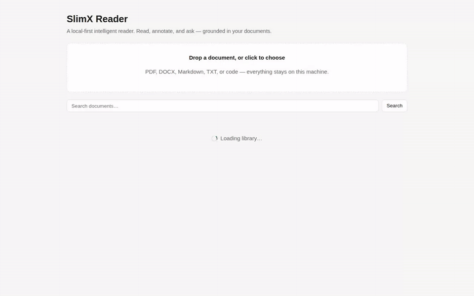
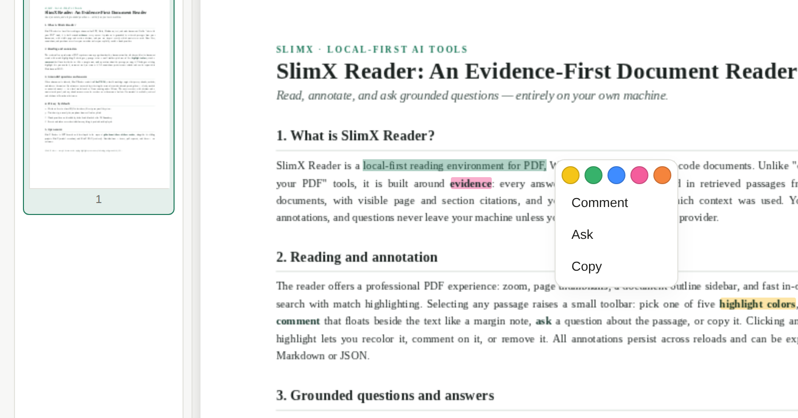
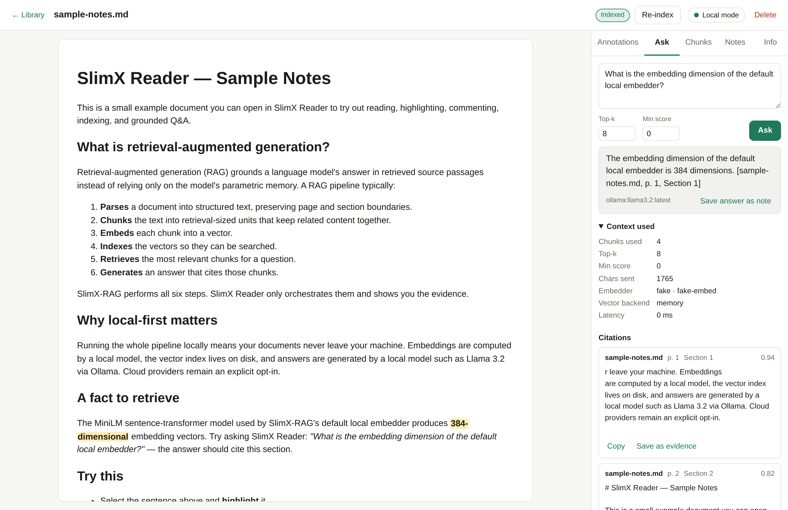

<div align="center">

# SlimX Reader

**A local-first intelligent PDF & document reader for students, researchers, and developers.**

Read, highlight in color, float comments beside the text, ask grounded questions, inspect
retrieved chunks, and save evidence — powered by [SlimX](https://github.com/slimx-ai/slimx) for
model execution and [SlimX-RAG](https://github.com/slimx-ai/SlimX-RAG) for indexing, retrieval,
and citations.

[](https://github.com/slimx-ai/slimx-reader/actions/workflows/ci.yml)
[](LICENSE)
[](https://github.com/slimx-ai/slimx-reader/releases)

</div>

<p align="center">
  
</p>

<p align="center">
  
  &nbsp;
  
</p>

---

## What it is

SlimX Reader is **not** "chat with your PDF." It is an **evidence-first reading environment**:

- Open or upload a **PDF, DOCX, Markdown, TXT, or code** file into a clean reader.
- A professional PDF experience — zoom, page **thumbnails and outline sidebar**, find with
  match highlighting and next/previous cycling, long-PDF virtualization, and a **local PDF.js
  worker** (no CDN).
- **Select → highlight in five colors, comment, ask, copy.** Selections snap to whole words;
  comments float beside the text like Google Docs; click any highlight to recolor, comment, or
  remove it. Annotations persist across reloads.
- **Index** a document with SlimX-RAG and **ask questions** grounded in retrieved chunks,
  with visible **page/section citations** — or select a passage and hit **Ask**.
- **Inspect** the retrieved context and **save** useful chunks or answers as evidence/notes.
- **Export** your notes, highlights, comments, and citations to Markdown or JSON.
- Everything works **locally by default** with Ollama/local models. Cloud is opt-in.

## Why local-first

Your documents and reading are yours. SlimX Reader runs entirely on your machine:
SQLite for metadata, the local filesystem for files, SlimX-RAG as a local service, and
Ollama (or any OpenAI-compatible local server) for models. There is **no telemetry**, and
**no data leaves your machine unless you explicitly enable a cloud provider**. See
[docs/privacy.md](docs/privacy.md) and [SECURITY.md](SECURITY.md).

## How it uses SlimX and SlimX-RAG

SlimX Reader owns the **product experience**; the SlimX ecosystem owns the hard parts:

| Layer | Owner | Responsibility |
|---|---|---|
| Reading, annotation, library, RAG inspection, export | **SlimX Reader** | UX + local persistence |
| Document parsing, chunking, embedding, indexing, retrieval, citations | **SlimX-RAG** | knowledge engine (HTTP service) |
| Model execution (Ollama / OpenAI-compatible / optional cloud) | **SlimX** | provider-agnostic LLM calls |

The reader never reimplements RAG or model plumbing. The frontend calls the Reader API;
the Reader API calls SlimX-RAG through a `RagAdapter` boundary and SlimX through a thin
model client. See [docs/architecture.md](docs/architecture.md) and
[docs/rag-integration.md](docs/rag-integration.md).

## Try it with zero install — SlimX Reader Lite (fully in-browser)

**SlimX Reader Lite** ([`apps/web-lite/`](apps/web-lite/)) is the same reader running **entirely
inside your browser tab** — no API server, no SlimX-RAG, no Ollama, no Docker. Your documents,
highlights, and notes are stored in the browser (IndexedDB); semantic search runs on
[Transformers.js](https://huggingface.co/docs/transformers.js) with the same
`all-MiniLM-L6-v2` embedder as the full stack; grounded answers run on
[WebLLM](https://github.com/mlc-ai/web-llm) (Llama 3.2). Nothing ever leaves the tab — it even
works offline once the models are cached.

```bash
cd apps/web-lite
npm install
npm run dev      # open http://localhost:3300
```

How to use it:

1. Open http://localhost:3300 — a sample document is preloaded. Drop in your own PDF / DOCX /
   Markdown / TXT / code file.
2. Read and annotate immediately. Indexing starts automatically; the first index downloads the
   ~23 MB embedding model once, then everything is cached.
3. Ask questions in the **Ask** tab. Out of the box you get **retrieval-only** results: the most
   relevant passages with `[Title, p. N]` citations.
4. For **generated answers**, click **Load** in the top status bar to fetch the answer model
   (Llama 3.2 3B ≈ 2 GB, or 1B ≈ 880 MB). This needs **WebGPU** — current Chrome or Edge.
   Without WebGPU you keep citations-only mode.
5. `npm run build` produces a static `dist/` you can host on any static site (Netlify,
   Cloudflare Pages, GitHub Pages…).

Use the Lite build to try SlimX Reader instantly or to demo it from a URL; use the full stack
below when you want server-grade indexing, Ollama/cloud model choice, and data on your
filesystem. Details in [`apps/web-lite/README.md`](apps/web-lite/README.md).

## Quick start

**One command** (Linux/macOS; bootstraps the Python venv + npm deps, runs the API on :8200 and
the web app on :3200):

```bash
cp .env.example .env
./scripts/dev.sh
```

Open http://localhost:3200 and drop in a document — try the samples in
[`examples/documents/`](examples/documents/). You can already **read and annotate**; indexing
and Q&A light up once SlimX-RAG (and a model) are running:

```bash
# 1. Start SlimX-RAG (offline hf embeddings + local vector backend) on :8080
docker compose -f docker-compose.rag.yml up
./scripts/check-rag.sh          # verify it's ready

# 2. Start a local model for answers (Ollama)
ollama serve
ollama pull llama3.2:3b         # or set READER_DEFAULT_MODEL to a model you have
```

**Docker instead** (builds the reader from source; add `--profile rag` for indexing/Q&A):

```bash
docker compose up --build                   # reader only: read + annotate
docker compose --profile rag up --build     # + SlimX-RAG indexing & grounded Q&A
```

Ports are published on `127.0.0.1` only — the API has no authentication by design (single-user
local app). Read [SECURITY.md](SECURITY.md) before exposing it further. On Windows, use Docker
or WSL (`dev.sh` is a bash script).

> The `slimx-rag` image is pull-only here (it lives in the
> [SlimX-RAG repo](https://github.com/slimx-ai/SlimX-RAG)); if the published image isn't
> available to you, build it there and set `SLIMX_RAG_IMAGE=slimx-rag:local`.

### Index a document and ask a question

1. Drop a **PDF / DOCX / Markdown / TXT / code** file onto the library (or click to choose).
2. Open it — PDFs render in the viewer with a thumbnails/outline sidebar; text/markdown render inline.
3. Select text and pick a **highlight color**, add a **Comment** (it floats beside the text),
   hit **Ask**, or **Copy**. Click any highlight to recolor, comment, or remove it.
4. Click **Index** (top bar). Watch the status go `uploaded → … → ready`; inspect the produced
   chunks in the **Chunks** tab.
5. In the **Ask** tab, ask a question. You get a grounded answer with a **context-used** panel and
   **citations** (page/section). Save a chunk as **evidence** or the answer as a **note**.
6. Export your annotations, notes, and citations from the **Info** tab (Markdown or JSON).

Manual dev without Docker (two terminals) is also fine — see
[docs/local-models.md](docs/local-models.md) and [docs/rag-integration.md](docs/rag-integration.md).

### Troubleshooting

- **Ports 3200/8200 busy** → `READER_WEB_PORT=3999 READER_API_PORT=8999 ./scripts/dev.sh`
- **"Waiting for SlimX-RAG"** → the RAG service isn't reachable; start it (see above) or keep
  reading/annotating — indexing resumes when it appears.
- **Answers say "No model"** → start Ollama (or configure any OpenAI-compatible server; see
  [docs/local-models.md](docs/local-models.md)). Retrieval and citations still work without one.

## Known limitations (v0.1)

- OCR for scanned/image-only PDFs is not included (they surface a clear message, never a
  fabricated answer).
- Word/DOCX files are read via extracted text, not native layout rendering.
- Annotations are app-level overlays; exporting them back into the PDF itself is future work.
- Cloud models are optional and **disabled by default**.
- No multi-user/team mode; no agents, MCP, or web search.

See [docs/roadmap.md](docs/roadmap.md) for what's next.

## Contributing

Contributions are welcome — see [CONTRIBUTING.md](CONTRIBUTING.md) and the
[good first issues](https://github.com/slimx-ai/slimx-reader/labels/good%20first%20issue).

## License

[MIT](LICENSE) © 2026 SlimX — see [NOTICE](NOTICE) for lineage and third-party credits.
SlimX and SlimX-RAG are also MIT-licensed.
